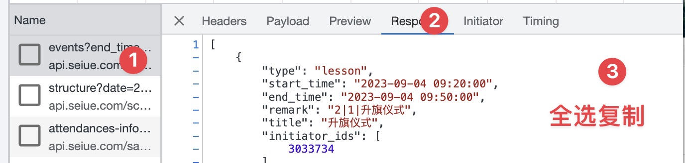

# 导出希悦课程至本地日历

## Prerequisite

- 安装 Python 环境

## Usage

首先在 Python 文件中设置学期结束时间（可选）
默认秋季学期结束日期为1月15日，春季为6月1日  
然后打开希悦，打开 F12，把课程表选择周视图，切换至有课程的一页


F12控制台 - Network - 筛选 Fetch/XHR - events?end_time ... 这条请求 - Response - 全选复制


在同一目录下创建 `data.json` 文件，将复制的内容粘贴进去
运行 python 程序
```bash
python3 path-to-your-directory/chalk-calender.py
```
打开目录下生成的 `schedule.ics` 即可
